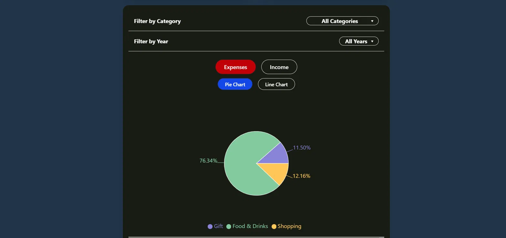
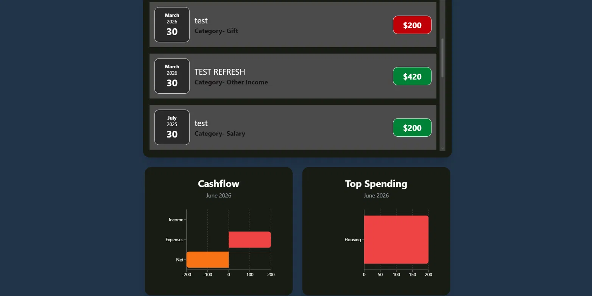

# 💰 Expense Tracker

A full-stack personal finance app that lets users track their income and expenses, visualize spending habits through charts, and monitor their wallet balance — all in one place.

**Live Demo:** [expense-tracker-alpha-ruddy.vercel.app](https://expense-tracker-alpha-ruddy.vercel.app)

---

## Screenshots





---

## Tech Stack

**Frontend**
- React 19
- Framer Motion (animations)
- Recharts (data visualization)
- Tailwind CSS (styling)
- Vite (build tool)

**Backend**
- Node.js + Express
- JSON file storage (`expenses.json`, `wallet.json`)
- Deployed on Railway

---

## Features

### Wallet
- Set an initial wallet balance
- Balance updates automatically when records are added, edited, or deleted
- Click the balance to change it at any time

### Records
- Add income or expense records with title, amount, category, date, and type
- Edit any existing record via a click-to-edit modal
- Delete records with instant balance adjustment
- Color-coded amount chips — green for income, red for expenses
- Scrollable list with animated entry and exit transitions

### Charts
- Toggle between **Expenses** and **Income** views
- Toggle between **Pie Chart** (breakdown by category) and **Line Chart** (trend over time)
- Filter records by **category** and **year** before charting

### Dashboard
- **Cashflow chart** — horizontal bar chart showing income, expenses, and net for the current month
- **Top Spending card** — shows the top 2 spending categories for the current month
- All dashboard data updates in real time as records change

### General
- Animated modals for adding and editing records
- Toast notifications for add, edit, and delete actions
- Fully responsive — works on mobile and desktop

---

## Use Case

Expense Tracker is built for individuals who want a simple, visual way to understand where their money is going. Users can log daily income and expenses, filter by category or year to spot trends, and get an at-a-glance summary of their monthly cashflow and top spending areas — without needing a complex banking integration.

---

## Project Structure

```
expensetracker/
├── backend/
│   ├── data/
│   │   ├── expenses.json
│   │   └── wallet.json
│   └── server.js
├── src/
│   ├── components/
│   │   ├── Chart/
│   │   │   ├── CashFlowChart.jsx
│   │   │   ├── ExpensesLineChart.jsx
│   │   │   ├── ExpensesPieChart.jsx
│   │   │   ├── IncomeLineChart.jsx
│   │   │   └── IncomePieChart.jsx
│   │   ├── BalanceContainer.jsx
│   │   ├── Expenses.jsx
│   │   ├── ExpenseForm.jsx
│   │   ├── ExpenseItem.jsx
│   │   ├── ExpensesList.jsx
│   │   ├── OtherDetails.jsx
│   │   ├── TopExpenses.jsx
│   │   └── Wallet.jsx
│   └── App.jsx
```

---

## Future Improvements

- **User accounts** — allow multiple users to have their own independent expense data
- **Database storage** — migrate from JSON file storage to a proper database (PostgreSQL or MySQL) for better scalability
- **Budget limits** — set monthly spending limits per category with alerts when approaching the limit
- **Export to CSV** — download expense history as a spreadsheet
- **Recurring transactions** — automatically add regular income or expenses (rent, salary, subscriptions)
- **Currency support** — allow users to select their preferred currency
- **Dark/light mode toggle** — give users the option to switch between themes
